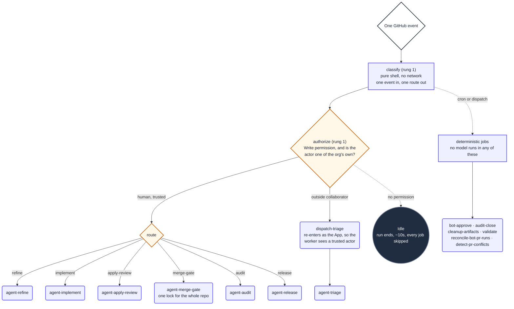
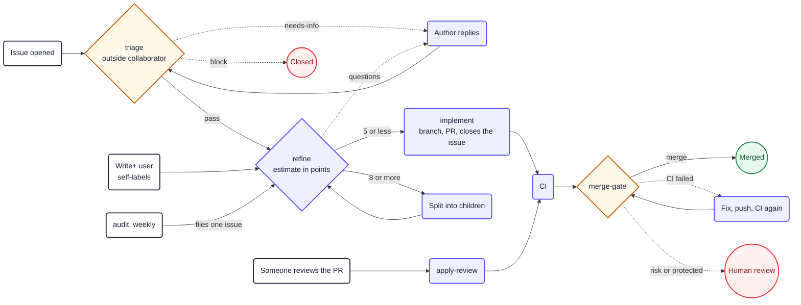
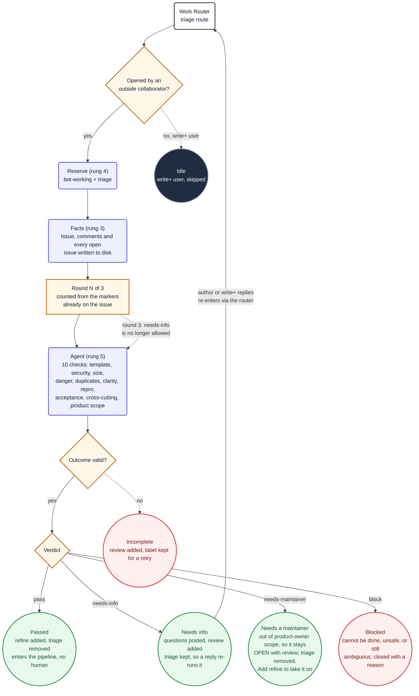
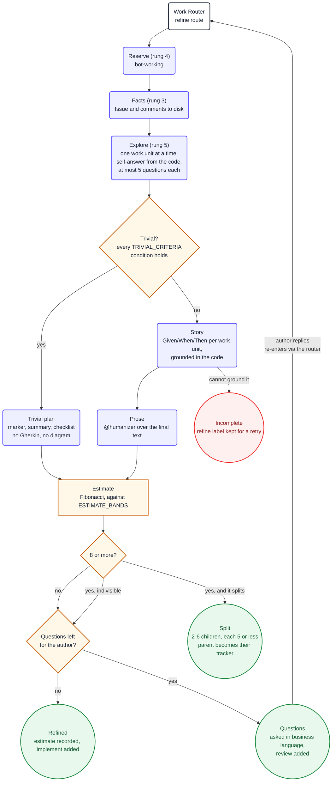
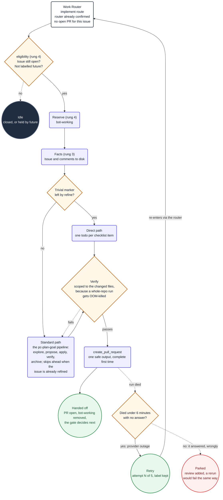
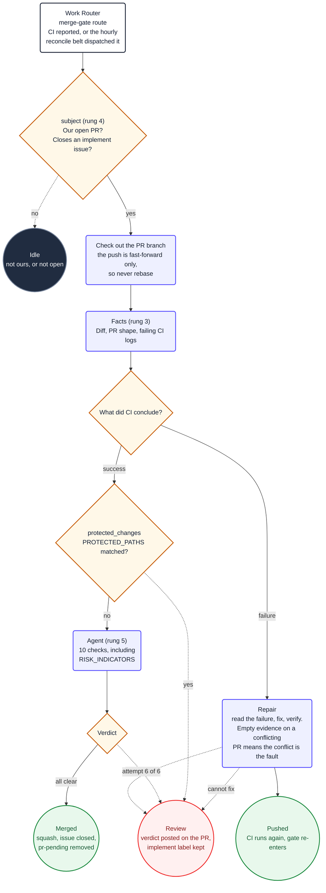
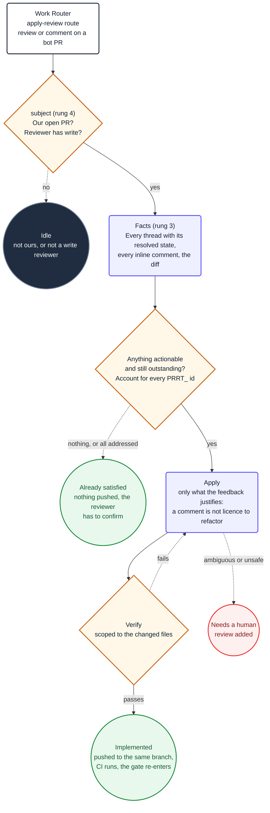
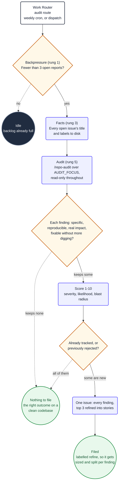
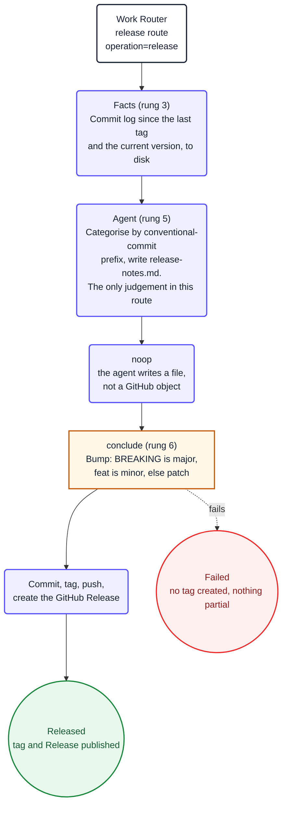

# Diagrams

One picture per route, plus the router that chooses between them.

These used to live at the bottom of each worker's markdown file. Everything below a worker's
frontmatter is the prompt, so each diagram was sent to the model on every run and then explicitly
skipped by a closing instruction telling it to ignore the section. They were about 240 lines across
the seven workers, and in the release worker's case 21 of its 48 prompt lines. They are documentation
for people, so they live here, and `verify-route-matrix.sh` fails if one reappears in a prompt.

Every diagram uses the same shapes and the same palette, so reading one teaches you the rest:

| Shape | Means |
|---|---|
| Rounded, indigo | a job that does something |
| Square, amber | a decision the workflow or the agent makes |
| Doubled circle, green | a terminal state that made progress |
| Doubled circle, red | a terminal state that needs a person |
| Doubled circle, dark | nothing to do, the run ends idle |
| Dotted arrow | the unhappy path |

Each worker diagram also names the rung each stage sits on, from the determinism ladder in
`skills/workflow-author`: the lower the rung, the cheaper and more reproducible the decision.

---

## The router

Every trigger the repository has arrives here, and exactly one thing happens per event. Nothing
else in the system subscribes to a public event, which is what makes a route addable or removable
without touching the others.

A run still appears for every matching event even when the router decides nothing downstream
happens; those cost about ten seconds with every job skipped. Reducing the count means generating
fewer events, not adding more guards.

### How the routes chain

Audit creates work rather than consuming it, and files into `refine` rather than straight to
`implement`, so a report of several unrelated findings becomes one properly sized issue per finding
instead of one pull request that has to fix them all.

---

## agent-triage.md

The front door for issues opened from outside the organisation. The gate is membership, not permission
level: an org member with write skips triage and self-labels into the pipeline, while an outside
collaborator goes through it even when they hold write.

Four outcomes, and only one of them closes anything. `needs-maintainer` is the one worth knowing: the
request is legitimate but addressed to the wrong intake, so the issue stays open with `review` and a
maintainer takes it on by adding `refine`.

---

## agent-refine.md

Decides the size of the work, which is the decision that determines whether it ever lands. An
estimate of 8 or more is split into children of 5 or less, and each child walks the pipeline alone.

---

## agent-implement.md

Writes the code and opens one pull request. It stops there: the merge decision belongs to the gate,
because waiting for CI inside this run would hold a fleet machine doing nothing.

The retry belt exists because a provider outage kills a run in a couple of minutes with no answer,
and that used to burn the issue and hand it to a human. A run that worked for half an hour and then
failed produced an answer that was wrong; repeating it costs the whole fleet the same half hour to
be wrong again, so only the short deaths are retried.

---

## agent-merge-gate.md

The only worker that merges. It runs one at a time for the whole repository, because several
overnight pull requests mean every merge moves the default branch under the rest.

A protected-path match holds the merge but does not stop the repair path: the agent may still fix
failed CI on those files, and `conclude` is what refuses to merge them.

---

## agent-apply-review.md

Applies a reviewer's feedback to a pull request the bot already opened, and pushes to the same
branch.

A reviewer often makes one point across several comments, so the whole conversation is on disk
before anything changes. Applying them one at a time produces contradictory commits.

---

## agent-audit.md

The only worker that creates work rather than consuming it. Read-only: it files an issue and
changes nothing.

Memory matters here: open issues only cover what is still open, so a finding reported weeks ago and
consciously not acted on would come back every single run. The audit records its dispositions and
reads them next time.

---

## agent-release.md

Manual dispatch only. The agent writes prose; a deterministic job does everything irreversible.

The version bump, the tag and the Release are deterministic on purpose. The agent's only output is
a file on disk, so a confused model cannot publish a release.
