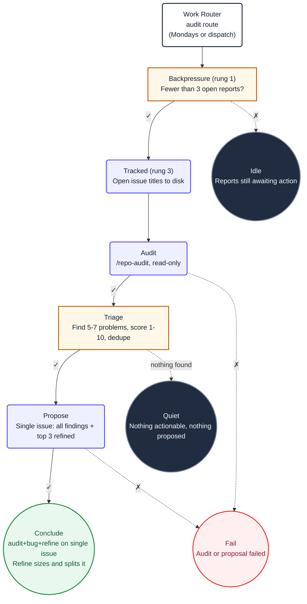

1. Call skill("pc-repo-audit"), then run `/repo-audit` as a read-only audit of this
   repository. Do not modify any file, do not commit, and do not push.

  2. Apply repository documentation and established conventions while auditing. Focus on
     concrete defects and avoid recommendations that weaken security, tests, or checks.
     Adhere to ${{ env.REPO_RULES }}.

    From the audit report, find **5 to 7 problems**. For each finding, verify it meets ALL
   of these criteria before keeping it:
   - A specific, reproducible problem in a specific file or component.
   - Has real impact: security risk, data loss, crash, or broken functionality.
   - Something a developer could pick up and fix without further investigation.
   Discard anything vague, stylistic, theoretical, or nice-to-have. If you cannot find 5 that
   meet this bar, file as many as you can. If you find zero, call `noop` and stop , that is a
   good result.

3. **Score each surviving finding from 1 to 10**, based on:
   | Factor | Weight |
   |---|---|
   | Severity (how bad is the impact?) | high |
   | Likelihood (how often does it trigger?) | medium |
   | Blast radius (how many users/components affected?) | medium |
   | Ease of fix (can it be fixed in one PR?) | low bonus |

   Write the score next to each finding in your reasoning.

4. Read `/tmp/gh-aw/agent/open-issues.json`, which lists every open issue with its title and
   labels. Discard any finding already tracked there. Exact-title duplicates are rejected for
   you; your job is the ones worded differently that mean the same thing.

   Open issues only cover what is still open, so a finding reported weeks ago and closed
   without a fix, or deliberately rejected, would come back every single run. Before scoring,
   call `memory_smart_search` for prior audits of this repository and drop any finding that
   was already reported and consciously not acted on. After you have decided what to file,
   call `memory_save` once with a compact record of this audit: the date, each finding's file
   and one-line description, and its disposition (filed, already tracked, or previously
   rejected). Keep it short; it is read by the next audit, not by a person.

   A finding you have reported before and that is genuinely still broken IS worth filing
   again. What this prevents is re-filing something the team looked at and chose to live
   with, which is the noise that makes an audit backlog get ignored.

5. Call `create_issue` **once** with title "Audit: <date>". Do NOT specify labels , the
   conclude job will apply them. The body MUST have two sections:

   **Section 1 , All findings:** A numbered list of every finding (5-7) with its score,
   file path, and a one-line description. Order by score descending.

   **Section 2 , Top 3 to implement:** Call skill("pc-plan-story") and refine the top 3
   findings by score into user stories in Mike Cohn's As a / I want to / so that format
   with Given/When/Then acceptance criteria, edge cases, and likely files to change. Mark
   this section clearly with a heading like `## Top 3 , To Implement`.

   The issue you file goes to Refine, not straight to implementation. Refine sizes it and,
   because a report of several unrelated defects across different files is exactly the shape
   that does not land as one pull request, splits it into one properly estimated issue per
   finding. Write each finding so it survives that split: self-contained, naming its own
   files and its own acceptance criteria, never "as above" or "same as finding 2".

6. If nothing met the bar, call `noop` and stop. Filing nothing is the right outcome when
   the codebase is clean.

## Diagram

