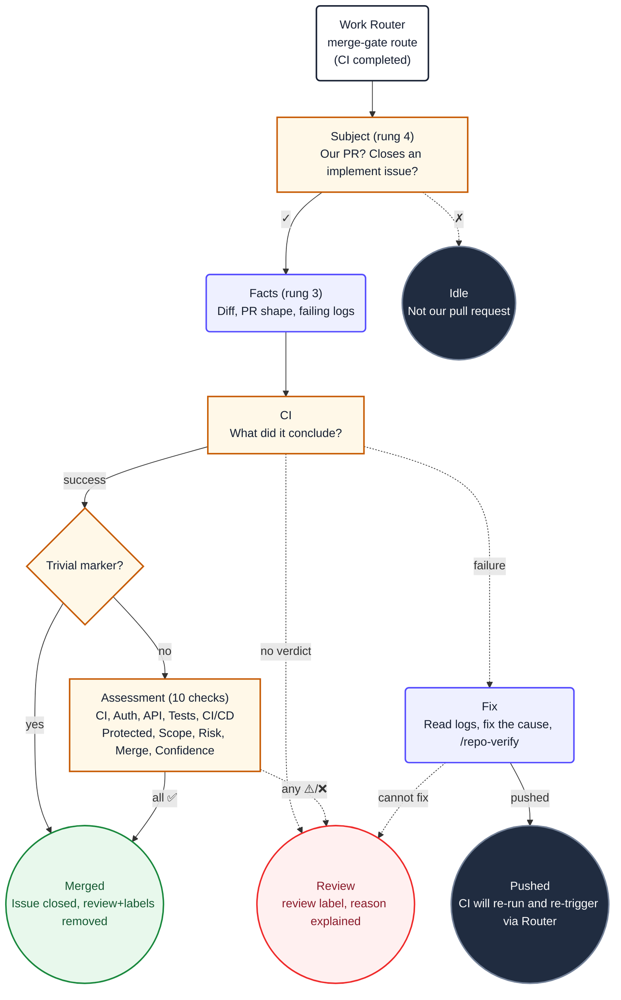

1. You are gating pull request **#${{ needs.subject.outputs.pr }}**, which closes issue
   **#${{ needs.subject.outputs.issue }}**. CI concluded
   **${{ needs.subject.outputs.conclusion }}**.

   It has already been confirmed that this is an open pull request we authored, that it closes
   an issue, and that the issue carries `implement`. Do not re-check any of that, and do not
   poll for checks: the conclusion above is the answer.

2. Read `${{ env.ISSUE_CONTEXT_PATH }}`. It contains the issue body and its discussion. When
   running `/repo-verify`, the acceptance criteria there define what the implementation must
   satisfy.

3. Branch on the conclusion.

   First check the issue context for `<!-- complexity: trivial -->`.

   **If the trivial marker is present AND CI conclusion is success:**
   Skip the full assessment (step 5). Emit a minimal assessment table with all checks marked
   ✅ and the note "Trivial change, CI green — deep risk review skipped." Then proceed directly
   to step 8 (merge verdict).

   **If the trivial marker is absent OR CI is not success:**
   Follow the normal branching below.

   - **success** → step 4, then step 5 (full assessment).
    - **action_required** → CI did not run because the workflow needs approval.
      Emit the assessment table with ❌ on CI Status and note that a maintainer must approve
      the pending run. Select the `review` verdict.
    - **failure** → step 4, then step 6 (CI remediation).
     - **cancelled, timed_out, or anything else** → Emit the assessment table with ❌ on CI
      Status and select the `review` verdict. A cancelled or unknown run is not evidence of
      anything.

     Follow repository documentation and established conventions when assessing or remediating
     the pull request. Protect secrets, do not bypass checks, and keep remediation focused.
     Adhere to ${{ env.REPO_RULES }}.

4. Read the diff and PR metadata. Read `/tmp/gh-aw/agent/diff.patch` in full and
   `/tmp/gh-aw/agent/pr.json` for the shape of the change. If CI failed, also read
   `/tmp/gh-aw/agent/failed-jobs.json` and `/tmp/gh-aw/agent/failed-logs.txt`.

   These files are the factual basis for every check below. Do not guess — cite what you read.

5. Run each of these 10 checks. For each, determine a status and a short detail line.

   **Check 1 — CI Status.** What did CI conclude? Success means all required checks passed.
   Failure means at least one job failed. Action required means a workflow needs approval.
   Flag any non-success conclusion.

   **Check 2 — Auth & Security.** Does the diff touch authentication, authorization, secrets,
   credentials, or security boundaries? Flag any change to auth middleware, permission checks,
   token issuance, or security-related config.

   **Check 3 — API & Contracts.** Does the diff change a public API or a published package's
   contract? Flag changes to endpoint signatures, DTO shapes, exported interfaces, or
   serialization formats that could break consumers.

   **Check 4 — Tests.** Does the diff delete, weaken, or lower a threshold in a test? Flag
   removed assertions, skipped tests, lowered coverage bars, or deleted test files.

   **Check 5 — CI/CD & Workflow files.** Does the diff change CI, CD, or workflow files?
   Flag changes to `.github/workflows/`, Dockerfiles, deployment scripts, or infrastructure
   configuration.

   **Check 6 — Protected files.** Does the diff change a protected file? This is normally
   handled before you run, but never merge one if it reaches this gate. Flag any match against
   the repository's protected file list.

   **Check 7 — Scope.** Is the diff size consistent with what the issue implied? Compare the
   number of files changed and lines added/removed against the complexity the issue described.
   Flag if the diff is materially larger or smaller than expected.

   **Check 8 — Repository risk indicators.** Does the diff touch any risk indicator defined in
   ${{ env.REPO_RULES }}? Review the repository guardrails for domain-specific risk areas such
   as calculation engines, audit chains, authentication, database migrations, or money handling.
   Flag any
   match and name the specific indicator.

   **Check 9 — Mergeability.** Can the PR be merged cleanly? The value is
   `${{ needs.reserve.outputs.has_conflicts }}`. If conflicts exist, this is ❌ but not a
   blocking verdict — proceed to remediation (step 6). If no conflicts, ✅.

   **Check 10 — Confidence.** Are you confident in the merge decision? Low confidence is
   itself a flag. If you are unsure about the impact of the change, mark ⚠️ and explain what
   is uncertain. A human should review when confidence is low.

6. **CI failed** → read `/tmp/gh-aw/agent/failed-jobs.json` and
   `/tmp/gh-aw/agent/failed-logs.txt`, which are already on disk. Load only skills required to
   fix the actual cause. Run these verification commands before a push. Do not weaken a test,
   disable a check, or push an unverified guess.

   **If `has_conflicts` is `true` (current value: `${{ needs.reserve.outputs.has_conflicts }}`):** You are already on the PR branch. Resolve the conflict;
   it is not a reason to hand the PR to a human. Merge `origin/${{ github.event.repository.default_branch }}`
   into the current branch, resolve every conflict deliberately, stage the resolutions, and
   commit the merge. Then run verification and push the resulting branch update. Do not use
   `--ours`, `--theirs`, or a blanket conflict-marker deletion without reviewing the intended
   behavior from both sides.

   ```
   ${{ env.VERIFY_COMMANDS }}
   ```

   Propose `push_to_pull_request_branch` (pr_number: ${{ needs.subject.outputs.pr }}, branch:
   the current PR branch), then select the `remediated` verdict. CI will run again and trigger
   you again with the new result.

   If you cannot fix it after a concrete repair attempt, or the logs show you have already tried on this same head commit,
   stop looping: select the `review` verdict and explain the failure and what you tried. A human
   decides from there.

7. Decide the verdict based on the assessment table:

   - **All checks ✅ → `merge`.** The PR is safe to merge. CI is green, no risk indicators
     triggered, tests are intact, scope matches, mergeability is clean.
   - **Any check ⚠️ or ❌ (except CI failure) → `review`.** Do not merge. Explain exactly which
     check tripped, why, and what a reviewer should look at. Leave `implement` in place: the
     work is not finished until a human merges it.
   - **CI failed and you fixed it → `remediated`.** You pushed a verified fix and CI will
     re-run.
   - **CI failed and you cannot fix it → `review`.** Explain the failure and what you tried.

   Never merge with administrator privileges and never bypass a required check. If the merge
   is refused, that refusal is the answer: select `review` and leave it for a human.

8. Emit exactly one `add_comment` targeting issue `${{ needs.subject.outputs.issue }}` with:
   1. `${{ env.GATE_MARKER }}`
   2. A heading: `## Merge gate decision for PR #${{ needs.subject.outputs.pr }}`
   3. A structured assessment table with all 10 check results
   4. A one-line detail per check (what was found and why it passed or flagged)
   5. A line `**Verdict:** merge`, `**Verdict:** review`, or `**Verdict:** remediated`

   The workflow applies comments, labels, merges, and closures with the App token. Do not call
   any tools except the one optional `push_to_pull_request_branch` for a verified CI repair
   and this one `add_comment`.

   Format the checks as a table with status indicators:

   ```
   ### Assessment

   #	Check	Result
   1	CI Status	✅ Success / ❌ Failure: [job name] / ⚠️ Action required
   2	Auth & Security	✅ No changes / ⚠️ Touched: [area]
   3	API & Contracts	✅ No changes / ⚠️ Changed: [area]
   4	Tests	✅ Not weakened / ⚠️ Weakened: [file]
   5	CI/CD & Workflow	✅ No changes / ⚠️ Changed: [file]
   6	Protected files	✅ None touched / ❌ Touched: [file]
   7	Scope	✅ Appropriately scoped / ⚠️ [too large/small: reason]
   8	Risk indicators	✅ None triggered / ⚠️ Triggered: [indicator]
   9	Mergeability	✅ Clean / ⚠️ Conflicts
   10	Confidence	✅ High / ⚠️ Low: [reason]
   ```

   Then a line `**Verdict:** merge` / `**Verdict:** review` / `**Verdict:** remediated`

9. Ignore the `## Diagram` section below. It is documentation for humans and contains no
   instructions for you.

## Diagram


